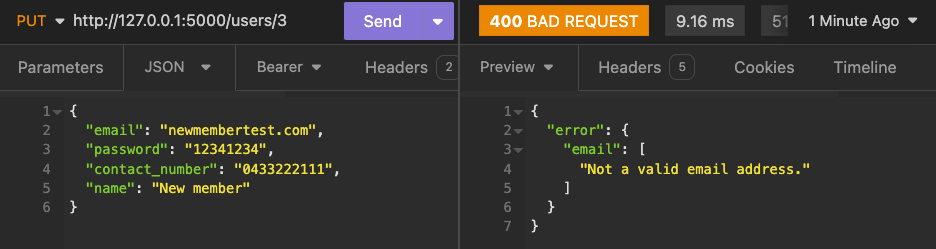
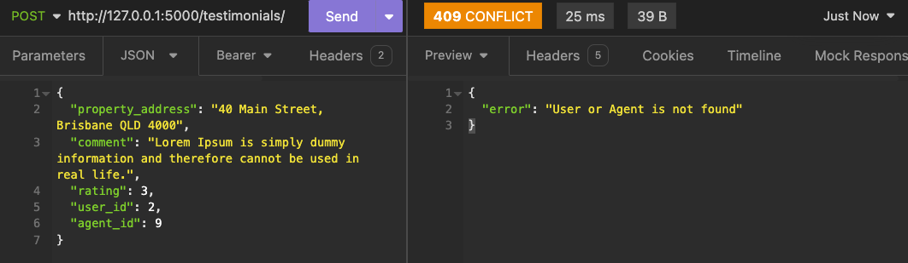

## T2A2: API Webserver

[https://github.com/Wing-Lo/real-estate-api-server](https://github.com/Wing-Lo/real-estate-api-server)

### R1. Explain the problem that this app will solve, and explain how this app solves or addresses the problem.

### Problem Statement

The real estate market is inherently complex and often challenging for homeowners looking to sell their properties. Finding a reliable and competent real estate agent who can effectively market and sell their property is crucial yet can be daunting due to the sheer number of agents available. Additionally, the process of scheduling appointments for property appraisals can be inefficient and time-consuming.

### Solution Overview

The proposed web application aims to streamline the process of connecting homeowners with suitable real estate agents, specifically targeting the need for users to find a selling agent to facilitate property sales. Here’s how the application addresses the identified problems:

1. **Agent Discovery and Selection**: The app provides a platform where users can search for real estate agents based on various criteria such as overviews, languages spoken, testimonials and ratings. This addresses the problem of finding a suitable agent by offering a curated list of agents who meet specific user preferences.

2. **Agent Profiles and Testimonials**: Each agent has a detailed profile that includes contact details, professional overview, languages spoken, testimonials and ratings from previous clients. This transparency helps users make informed decisions based on the experiences of others, thereby addressing concerns about agent reliability and competence.

3. **Testimonials and Ratings**: Users can view and post testimonials and ratings for agents they have interacted with. This feature builds trust and credibility within the platform, helping users gauge an agent’s track record and performance before engaging their services.

4. **Appointment Scheduling**: The app facilitates the booking of appointments with agents for property appraisals. This scheduling feature simplifies the process for users, eliminating the need for extensive phone calls or emails to arrange meetings, thus saving time and improving efficiency.

### Detailed Explanation

**Agent Discovery and Selection**: According to the National Association of Realtors (NAR), choosing the right real estate agent is one of the most critical factors affecting the sale of a property. The application aggregates agent information in one place, making it easier for users to compare and select agents based on their specific needs and preferences (NAR, 2022).

**Agent Profiles and Testimonials**: Transparency and reputation are crucial in the real estate industry. Research by Zillow indicates that over 80% of home sellers consider agent reputation and track record essential in their decision-making process (Zillow Research, 2023). By providing detailed agent profiles with testimonials and ratings, the app helps users assess an agent’s suitability and credibility.

**Testimonials and Ratings**: User-generated testimonials and ratings serve as social proof, influencing potential clients’ perceptions and decisions. A study by BrightLocal found that 88% of consumers trust online reviews as much as personal recommendations (BrightLocal, 2021). The app leverages this by allowing users to share their experiences and read others’ feedback, fostering trust and confidence in agent selection.

**Appointment Scheduling**: Efficient appointment scheduling is crucial for user convenience and agent efficiency. According to a survey by Realtor.com, 42% of home sellers prefer platforms that offer easy appointment scheduling features (Realtor.com Survey, 2023). The app’s booking system simplifies this process, enhancing user experience and agent-client interaction.

### Conclusion

In conclusion, the web application addresses the challenges faced by homeowners in finding and selecting real estate agents for property sales. By offering comprehensive agent profiles, testimonials, ratings, and streamlined appointment scheduling, the app aims to enhance transparency, trust, and efficiency in the real estate agent selection process. This not only benefits users seeking to sell their properties but also supports agents by facilitating better client connections and showcasing their professional capabilities effectively.

### Reference List

National Association of Realtors. (2022). Choosing a Real Estate Agent. Retrieved from  https://www.nar.realtor/choosing-a-real-estate-agent
Zillow Research. (2023). What Home Sellers Want. Retrieved from https://www.zillow.com/research/home-sellers-want-35481/
BrightLocal. (2021). Local Consumer Review Survey. Retrieved from https://www.brightlocal.com/research/local-consumer-review-survey/Realtor.com. (2023). Survey on Home Sellers' Preferences. Retrieved from https://www.realtor.com/research/survey-home-sellers-preferences

### R2. Describe the way tasks are allocated and tracked in your project.

In managing my project, I chose to use Trello as my main tool for task allocation and tracking. I organised my project tasks into three lists: "To Do," "In Progress," and "Done" within Trello to visually manage the status of each task. This approach allows me to prioritise and focus on completing tasks efficiently.

Each task in Trello includes a due date, which helps me stay disciplined and ensures I keep on track with my project timeline. This setup is crucial for maintaining a sense of progress and meeting project milestones.

For tasks that require detailed implementation, such as creating the database, models, and blueprints for entities like users, agents, testimonials, and bookings, I utilised Trello's checklist feature. This allows me to break down complex tasks into smaller, manageable sub-tasks. I also used the checklist feature to handle all endpoints testing. Checking off items on the checklist ensures that I cover all necessary aspects of each task before marking it as complete.

Regular stand-up posts have been part of my routine to review progress, adjust priorities, and reflect on any challenges encountered. This practice helps me maintain focus and adapt to any changes or new insights that arise during the project.

Overall, Trello has been an effective tool for me to organise, track, and manage my project tasks independently, ensuring I stay productive and meet my project goals effectively.

16/06/2024: Draw ERD for database design


17/06/2024: Project setup and basic error handling


18/06/2024: Database structure in postgresql


19/06/2024: Sqlalchemy model and marshmallow schemas


20/06/2024: JWT authentication for user and admin


21/06/2024 - 23/06/2024: Blueprints for `users` and `testimonials`


24/06/2024: Blueprints for `agents`


25/06/2024: Blueprints for `appointments`


26/06/2024: Testing endpoints and add more validation


27/06/2024: Adding inline comments


28/06/2024 - 29/06/2024: Documentation


### R3. List and explain the third-party services, packages and dependencies used in this app.

1. **Flask**
   - **Description**: Flask is a lightweight and flexible web framework for Python. It provides the basic tools and libraries needed to build a web application, including routing, templates, and request handling.
   - **Usage in Project**: Flask is used as the core framework for building the entire web application. It handles routing requests to the appropriate functions (views), manages templates, and integrates with various extensions for additional functionalities.

2. **Flask SQLAlchemy**
   - **Description**: Flask SQLAlchemy is an extension that adds SQLAlchemy support to Flask applications. SQLAlchemy is an SQL toolkit and Object-Relational Mapping (ORM) library for Python.
   - **Usage in Project**: SQLAlchemy is used to interact with the database. Flask SQLAlchemy simplifies the integration of SQLAlchemy with Flask by providing ORM capabilities, allowing developers to define database models as Python classes and perform database operations using high-level objects and methods.

3. **Flask JWT Extended**
   - **Description**: Flask JWT Extended is a Flask extension that adds JSON Web Token (JWT) support to Flask applications. JWTs are used for stateless authentication by securely transmitting information between parties.
   - **Usage in Project**: Flask JWT Extended is used to manage user authentication and authorization in the application. It provides decorators (`jwt_required`, etc.) to protect routes that require authentication, and it generates and verifies JWTs to authenticate users based on tokens.

4. **Flask Bcrypt**
   - **Description**: Flask Bcrypt is a Flask extension that integrates bcrypt hashing algorithms for password hashing.
   - **Usage in Project**: Flask Bcrypt is used to securely hash and verify passwords stored in the database. It enhances security by ensuring passwords are not stored in plaintext, making it computationally expensive for attackers to brute-force or reverse-engineer passwords.

5. **Marshmallow**
   - **Description**: Marshmallow is an ORM/ODM framework-agnostic library for converting complex data types to and from native Python data types.
   - **Usage in Project**: Marshmallow is used for data serialization and deserialization, crucial for converting objects to dictionary formats and vice versa. In this project, Marshmallow is integrated with Flask SQLAlchemy to define schemas (`UserSchema`, `AgentSchema`, `AppointmentSchema`, `TestimonialSchema`). These schemas not only facilitate the conversion of database models to JSON responses and vice versa but also enforce robust validation rules. For instance, they ensure fields like `name`, `email`, and `password` meet specific criteria such as required presence, length constraints, and pattern validation using regular expressions, ensuring data integrity throughout the application's data lifecycle.

6. **SQLAlchemy**
   - **Description**: SQLAlchemy is an SQL toolkit and Object-Relational Mapping (ORM) library for Python. It provides a full suite of well-known enterprise-level persistence patterns.
   - **Usage in Project**: SQLAlchemy is used directly with Flask SQLAlchemy to interact with the relational database. It handles the generation of SQL queries, object-relational mapping, and database schema management. SQLAlchemy helps in abstracting the database interactions, making it easier to work with relational databases in Python.

7. **JWT**
   - **Description**: PyJWT is a Python library for JSON Web Token (JWT) encoding and decoding according to the JSON Web Token standard (RFC 7519).
   - **Usage in Project**: PyJWT is used internally by Flask JWT Extended to generate, parse, and validate JWTs. It provides functions and classes to securely create tokens containing claims (such as user ID, expiration time) and verify them to ensure their authenticity and integrity during token-based authentication.

These third-party services, packages, and dependencies collectively provide the necessary tools and functionalities to build a secure and efficient web application with Flask. Each plays a crucial role in different aspects of this application, from handling HTTP requests and authentication to database management and serialisation of data.

### R4. Explain the benefits and drawbacks of this app’s underlying database system.

I chose PostgreSQL as the underlying database system for its robustness and advanced features. Below, I outline the benefits and drawbacks of using PostgreSQL in this app:

#### Benefits

1. **Reliability and Stability**
   - **Benefit**: PostgreSQL is known for its reliability and stability. It ensures data integrity and supports ACID (Atomicity, Consistency, Isolation, Durability) properties, making it a great choice for applications that require robust transaction handling.
   - **Example**: In my application, operations like user registration, login, and updates involve multiple steps that need to be executed reliably. PostgreSQL ensures these multi-step operations are completed successfully or rolled back to maintain data consistency.

2. **Advanced Features**
   - **Benefit**: PostgreSQL offers advanced features such as support for complex queries, full-text search, and JSON data types, which allow for flexible and efficient data handling.
   - **Example**: For example, the `languages` column in the `Agent` model can be stored as an array, allowing easy storage and retrieval of multiple languages an agent speaks.
     ```python
     class Agent(db.Model):
         id = db.Column(db.Integer, primary_key=True)
         name = db.Column(db.String(50), nullable=False)
         email = db.Column(db.String(100), unique=True, nullable=False)
         contact_number = db.Column(db.String(20), nullable=False)
         overview = db.Column(db.Text, nullable=False)
         languages = db.Column(db.ARRAY(db.String), nullable=False)
     ```

3. **Strong Community and Ecosystem**
   - **Benefit**: PostgreSQL has a strong, active community and a rich ecosystem of tools and extensions, making it easier to find support, resources, and integrations for various needs.
   - **Example**: Leveraging tools like pgAdmin for database management or using extensions like PostGIS for geospatial data enhances the capabilities of the application without needing significant custom development.

4. **Performance Optimization**
   - **Benefit**: PostgreSQL offers various performance optimization features, such as indexing, query optimization, and the ability to handle large volumes of data efficiently.
   - **Example**: In my application, indexing frequently queried columns (like `email` in the `User` model) helps improve query performance.
     ```python
     class User(db.Model):
         id = db.Column(db.Integer, primary_key=True)
         name = db.Column(db.String(50), nullable=False)
         email = db.Column(db.String(100), unique=True, nullable=False, index=True)
         contact_number = db.Column(db.String(20), nullable=False)
         password = db.Column(db.String(200), nullable=False)
         is_admin = db.Column(db.Boolean, default=False)
     ```

#### Drawbacks

1. **Complexity in Setup and Maintenance**
   - **Drawback**: PostgreSQL can be more complex to set up and maintain compared to some other databases. It requires proper configuration and tuning to achieve optimal performance.
   - **Example**: Setting up PostgreSQL involves configuring parameters like memory allocation, connection limits, and performance tuning, which can be challenging without adequate knowledge and experience.

2. **Resource Intensive**
   - **Drawback**: PostgreSQL can be resource-intensive, especially under high load or with complex queries. It requires sufficient hardware resources (CPU, memory, storage) to perform optimally.
   - **Example**: Running a PostgreSQL database on a small server or with limited resources may lead to performance bottlenecks, requiring careful monitoring and scaling as the application grows.

3. **Migration Overheads**
   - **Drawback**: Migrating data from other database systems to PostgreSQL can involve significant overhead, particularly if there are compatibility issues or differences in data types and features.
   - **Example**: If I were to migrate from another database system to PostgreSQL, I would need to handle differences in SQL syntax, data types, and possibly rewrite parts of the application to accommodate these changes.

4. **Learning Curve**
   - **Drawback**: PostgreSQL's advanced features and capabilities come with a steeper learning curve compared to simpler database systems. This can be a barrier for new developers.
   - **Example**: New developers joining the project may require additional time and training to become proficient in using PostgreSQL and understanding its advanced features.

In conclusion, while PostgreSQL provides robust and advanced features that greatly benefit the application's reliability, performance, and flexibility, it also comes with challenges related to setup, maintenance, resource usage, and learning curve. As the developer, I have leveraged PostgreSQL's strengths to build a reliable and efficient application, while also being mindful of its complexities and requirements.

### R5. Explain the features, purpose and functionalities of the object-relational mapping system (ORM) used in this app.

In this project, I heavily leverage SQLAlchemy, a powerful and flexible ORM system, to handle the interaction between the application and the relational database. SQLAlchemy allows me to map Python classes to database tables and manage database operations using Python code, which simplifies database interactions and enhances code readability and maintainability.

#### Key Features, Purpose, and Functionalities of SQLAlchemy in This App

1. **Object-Relational Mapping (ORM)**
   - SQLAlchemy's core feature is its ORM capability, which allows me to map Python classes to database tables. This mapping enables me to interact with the database using Python objects instead of writing raw SQL queries.
   - **Example**:
     ```python
     from init import db

     class User(db.Model):
         __tablename__ = 'users'
         id = db.Column(db.Integer, primary_key=True)
         name = db.Column(db.String(50), nullable=False)
         email = db.Column(db.String(100), unique=True, nullable=False)
         contact_number = db.Column(db.String(20), nullable=False)
         password = db.Column(db.String(200), nullable=False)
         is_admin = db.Column(db.Boolean, default=False)

     class Testimonial(db.Model):
         __tablename__ = 'testimonials'
         id = db.Column(db.Integer, primary_key=True)
         property_address = db.Column(db.String(100), nullable=False)
         comment = db.Column(db.Text, nullable=False)
         rating = db.Column(db.Integer, nullable=False)
         date_created = db.Column(db.Date, nullable=False)
         user_id = db.Column(db.Integer, db.ForeignKey('users.id'), nullable=False)
         agent_id = db.Column(db.Integer, db.ForeignKey('agents.id'), nullable=False)
     ```

2. **Data Sanitization**
   - By utilizing SQLAlchemy, I ensure that data is automatically sanitized, which helps prevent SQL injection attacks and other security vulnerabilities. SQLAlchemy takes care of escaping special characters and handling parameters correctly, which is crucial for maintaining the integrity and security of the database.
   - **Example**:
     ```python
     @users_bp.route("/<int:user_id>", methods=["PUT", "PATCH"])
     @jwt_required()
     def update_user(user_id):
         user = User.query.get(user_id)

         if user:
             admin_or_owner_required(user_id)
             user_info = UserSchema().load(request.json, partial=True)
             user.name = user_info.get("name", user.name)
             user.email = user_info.get("email", user.email)
             user.password = bcrypt.generate_password_hash(
                 user_info.get("password", user.password)
             ).decode("utf-8")
             user.contact_number = user_info.get("contact_number", user.contact_number)

             db.session.commit()

             return UserSchema(exclude=["password"]).dump(user)
         else:
             return {"error": "User not found"}, 404
     ```

3. **Relationships and Associations**
   - SQLAlchemy enables me to define relationships between different tables, such as one-to-many and many-to-many relationships. This helps in organizing data efficiently and enables complex queries and data retrieval.
   - **Example**:
     ```python
     class User(db.Model):
         __tablename__ = 'users'
         id = db.Column(db.Integer, primary_key=True)
         name = db.Column(db.String(50), nullable=False)
         email = db.Column(db.String(100), unique=True, nullable=False)
         testimonials = db.relationship('Testimonial', backref='user', lazy=True)

     class Testimonial(db.Model):
         __tablename__ = 'testimonials'
         id = db.Column(db.Integer, primary_key=True)
         property_address = db.Column(db.String(100), nullable=False)
         comment = db.Column(db.Text, nullable=False)
         rating = db.Column(db.Integer, nullable=False)
         date_created = db.Column(db.Date, nullable=False)
         user_id = db.Column(db.Integer, db.ForeignKey('users.id'), nullable=False)
         agent_id = db.Column(db.Integer, db.ForeignKey('agents.id'), nullable=False)
     ```

4. **Querying**
   - SQLAlchemy's ORM allows me to write complex queries using Python syntax. This makes the code more intuitive and easier to understand compared to raw SQL queries.
   - **Example**:
     ```python
     @testimonials_bp.route("/", methods=["GET"])
     @jwt_required()
     def get_all_testimonials():
         stmt = db.select(Testimonial).order_by(Testimonial.id)
         testimonials = db.session.scalars(stmt).all()
         return TestimonialSchema(many=True, exclude=["agent_id", "user_id"]).dump(testimonials)
     ```

5. **Serialization and Deserialization**
   - By using Marshmallow along with SQLAlchemy, I can easily serialize and deserialize data, converting complex data types to and from native Python data types.
   - **Example**:
     ```python
     from models.testimonial import TestimonialSchema

     @testimonials_bp.route("/<int:testimonial_id>", methods=["GET"])
     @jwt_required()
     def get_one_testimonial(testimonial_id):
         stmt = db.select(Testimonial).filter_by(id=testimonial_id)
         testimonial = db.session.scalar(stmt)
         if testimonial:
             return TestimonialSchema(exclude=["agent_id", "user_id"]).dump(testimonial)
         else:
             return {"error": "Testimonial not found"}, 404
     ```

### Conclusion

SQLAlchemy is a critical component of my application, providing robust ORM capabilities that streamline database interactions, ensure data integrity, and enhance security through data sanitization. By leveraging SQLAlchemy's features, I can maintain clean and efficient code, manage database migrations, and define complex relationships between data models, ultimately resulting in a well-structured and secure application.

### R6. Design an entity relationship diagram (ERD) for this app’s database, and explain how the relations between the diagrammed models will aid the database design. 


### Detailed Analysis of the ERD:

- **Users Table**:
  - **Attributes**: `id`, `name`, `email`, `contact_number`, `password`, `is_admin`
  - **Role**: Stores essential information about users, enabling management of user accounts, authentication, and differentiation between regular users and admin users.

- **Agents Table**:
  - **Attributes**: `id`, `name`, `email`, `contact_number`, `overview`, `languages`
  - **Role**: Holds information about agents, allowing management of agent profiles, providing details about their services, and highlighting the languages they speak.

- **Appointments Table**:
  - **Attributes**: `id`, `date`, `time`, `user_id`, `agent_id`
  - **Role**: Manages all scheduling information. It links users to their scheduled appointments with agents, ensuring efficient time management and service delivery.

- **Testimonials Table**:
  - **Attributes**: `id`, `property_address`, `comment`, `rating`, `date_created`, `user_id`, `agent_id`
  - **Role**: Captures user feedback about agents. It stores and organises testimonials, making it easier to analyse user satisfaction and agent performance.

### Users and Appointments Relationship:

- **One-to-Many**: A single user can schedule multiple appointments.
- **Design Benefit**: This allows the system to keep track of all appointments made by each user. By linking appointments to users with the `user_id` foreign key in the Appointments table, it becomes easy to query the database to see which appointments belong to a particular user. This helps in personalising user experiences and managing user schedules efficiently.

### Agents and Appointments Relationship:

- **One-to-Many**: A single agent can handle multiple appointments.
- **Design Benefit**: This relationship enables effective management of each agent's schedule. By linking appointments to agents using the `agent_id` foreign key, it is possible to see which appointments are assigned to which agents. This ensures that agents are not double-booked and helps in managing their time efficiently.

### Users and Testimonials Relationship:

- **One-to-Many**: A single user can write multiple testimonials.
- **Design Benefit**: This helps in tracking all feedback provided by users. By associating testimonials with users through the `user_id` foreign key, all testimonials a user has written can be gathered. This is useful for analysing user satisfaction and identifying loyal customers who provide feedback regularly.

### Agents and Testimonials Relationship:

- **One-to-Many**: A single agent can receive multiple testimonials.
- **Design Benefit**: This relationship enables the collection of all feedback an agent receives. By linking testimonials to agents using the `agent_id` foreign key, it is possible to see how many and what type of feedback each agent gets. This helps in evaluating agent performance and identifying top-performing agents based on user feedback.

### Benefits of These Relationships:

1. **Data Integrity**:
   - **Ensured Consistency**: Foreign keys ensure that appointments and testimonials are always linked to valid users and agents, preventing data inconsistencies.
   - **Referential Integrity**: Foreign keys prevent orphan records, ensuring that every appointment and testimonial is associated with an existing user and agent.

2. **Data Retrieval**:
   - **Efficient Queries**: The relationships make it easy to retrieve relevant data. For instance, it is straightforward to find all appointments for a user or all testimonials for an agent, enhancing the app's responsiveness and user experience.
   - **Complex Queries**: The structure supports advanced queries, such as finding the agent with the highest number of appointments or the best user feedback, aiding in data-driven decision-making.

3. **Scalability**:
   - **Ease of Expansion**: The design allows for the addition of new entities or relationships with minimal disruption, supporting future growth and feature additions.
   - **Handling Growth**: The database can efficiently handle an increasing number of users, agents, appointments, and testimonials, ensuring the app remains responsive as it scales.

4. **User and Agent Management**:
   - **Comprehensive Management**: The clear structure aids in managing user accounts, scheduling, and feedback effectively, ensuring a seamless experience for both users and agents.
   - **Role Differentiation**: The inclusion of admin roles allows for advanced management capabilities, such as overseeing user activities and maintaining system integrity.

### Normalization Explanation:

The diagram indicates a normalized database in the third normal form (3NF). This level of normalization ensures that:

- Elimination of redundancy.
- Reduction of update anomalies.
- Improvement in data integrity.

By designing the database with these relationships, a robust, scalable, and efficient system is created that can handle the core functionalities of the app while providing a great user experience.

### R7. Explain the implemented models and their relationships, including how the relationships aid the database implementation.

In my project, I've implemented several models using SQLAlchemy to represent different entities and their relationships in the database. 

### Implemented Models and Their Relationships

#### 1. User Model

The `User` model represents users of the application. It stores essential user information such as name, email, contact number, hashed password, and whether the user is an admin.

```python
from init import db, bcrypt

class User(db.Model):
    __tablename__ = 'users'

    id = db.Column(db.Integer, primary_key=True)
    name = db.Column(db.String(100), nullable=False)
    email = db.Column(db.String(100), unique=True, nullable=False)
    password = db.Column(db.String(100), nullable=False)
    contact_number = db.Column(db.String(20))
    is_admin = db.Column(db.Boolean, default=False)

    testimonials = db.relationship('Testimonial', back_populates='user', cascade='all, delete-orphan')
    appointments = db.relationship('Appointment', back_populates='user', cascade='all, delete-orphan')
```

- **Relationships**: 
  - `testimonials`: One-to-Many relationship with `Testimonial` model. One user can have multiple testimonials.
  - `appointments`: One-to-Many relationship with `Appointment` model. One user can have multiple appointments.
  
#### 2. Agent Model

The `Agent` model represents agents in the system. It includes details such as name, email, contact number, overview, and languages spoken.

```python
class Agent(db.Model):
    __tablename__ = 'agents'

    id = db.Column(db.Integer, primary_key=True)
    name = db.Column(db.String(100), nullable=False)
    email = db.Column(db.String(100), unique=True, nullable=False)
    contact_number = db.Column(db.String(20))
    overview = db.Column(db.Text())
    languages = db.Column(db.ARRAY(db.String(50)))

    testimonials = db.relationship('Testimonial', back_populates='agent', cascade='all, delete-orphan')
    appointments = db.relationship('Appointment', back_populates='agent', cascade='all, delete-orphan')
```

- **Relationships**: 
  - `testimonials`: One-to-Many relationship with `Testimonial` model. One agent can have multiple testimonials.
  - `appointments`: One-to-Many relationship with `Appointment` model. One agent can have multiple appointments.

#### 3. Testimonial Model

The `Testimonial` model stores feedback and ratings given by users for agents. It includes fields like property address, comment, rating, and date created.

```python
class Testimonial(db.Model):
    __tablename__ = 'testimonials'

    id = db.Column(db.Integer, primary_key=True)
    property_address = db.Column(db.String(250), nullable=False)
    comment = db.Column(db.Text(), nullable=False)
    rating = db.Column(db.Integer, nullable=False)
    date_created = db.Column(db.Date())

    user_id = db.Column(db.Integer, db.ForeignKey('users.id', onupdate="cascade", ondelete='cascade'), nullable=False)
    agent_id = db.Column(db.Integer, db.ForeignKey('agents.id', onupdate="cascade", ondelete='cascade'), nullable=False)

    user = db.relationship('User', back_populates='testimonials')
    agent = db.relationship('Agent', back_populates='testimonials')
```

- **Relationships**: 
  - `user`: Many-to-One relationship with `User` model. Many testimonials can belong to one user.
  - `agent`: Many-to-One relationship with `Agent` model. Many testimonials can belong to one agent.

#### 4. Appointment Model

The `Appointment` model represents scheduled appointments between users and agents. It includes fields for date, time, user ID, and agent ID.

```python
class Appointment(db.Model):
    __tablename__ = 'appointments'

    id = db.Column(db.Integer, primary_key=True)
    date = db.Column(db.Date(), nullable=False)
    time = db.Column(db.Time(), nullable=False)

    user_id = db.Column(db.Integer, db.ForeignKey('users.id', onupdate="cascade", ondelete='cascade'), nullable=False)
    agent_id = db.Column(db.Integer, db.ForeignKey('agents.id', onupdate="cascade", ondelete='cascade'), nullable=False)

    user = db.relationship('User', back_populates='appointments')
    agent = db.relationship('Agent', back_populates='appointments')
```

- **Relationships**: 
  - `user`: Many-to-One relationship with `User` model. Many appointments can belong to one user.
  - `agent`: Many-to-One relationship with `Agent` model. Many appointments can belong to one agent.

### How Relationships Aid the Database Implementation

- **Data Integrity**: Relationships enforce referential integrity, ensuring that every testimonial, appointment, or association is linked to valid users and agents. This prevents orphan records and maintains data consistency.
  
- **Efficient Queries**: By defining relationships, SQLAlchemy allows for efficient querying and navigation across related entities. For example, fetching all testimonials for a specific agent or all appointments for a user becomes straightforward and optimized.

- **Cascade Operations**: Cascade options (`cascade='all, delete-orphan'`) automate operations such as deleting testimonials or appointments when their associated user or agent is deleted. This simplifies database maintenance and ensures data coherence without manual intervention.

In conclusion, the models and their defined relationships in this project using SQLAlchemy ORM contribute to a structured database schema, optimised querying capabilities, and automated data management operations, thereby enhancing application scalability and maintainability.

### R8. Explain how to use this application’s API endpoints

#### 1. Authentication Endpoints

**Register User**
- **HTTP Verb**: POST
- **Path**: `/auth/register`
- **Required Body Data**: 
  - JSON object containing `name`, `email`, `contact_number`, and `password`.
- **Response**: 
  - Returns a JSON object with user information excluding the password.
  - Status code 201 for successful registration.
  - Status code 409 if the email address is already in use.
  - Status code 400 if the email address is not valid.
  - Status code 400 if the name has 0 or more than 100 characters.
  - Status code 400 if there is a missing field.
  - Status code 400 if the password is less than 8 characters.

Example: Successful registration


Example: Email address is already in use


Example: Email address is not valid


Example: No input in name.


Example: Missing field in name


Example: Password is less than 8 characters


**Login User**
- **HTTP Verb**: POST
- **Path**: `/auth/login`
- **Required Body Data**: 
  - JSON object containing `email` and `password`.
- **Response**: 
  - Returns a JSON object with a JWT token and user information excluding the password upon successful login.
  - Status code 200 for successful login.
  - Status code 401 for invalid email or password.

Example: Successful login


Example: Invalid email or password


#### 2. User Management Endpoints

**Get All Users**
- **HTTP Verb**: GET
- **Path**: `/users/`
- **Required Header Data**: 
  - JWT token in the Authorization header. (Admin required)
- **Response**: 
  - Returns a JSON array of user objects excluding the password.
  - Status code 200 for successful retrieval.
  - Status code 401 for missing authorization header.
  - Status code 403 for Unauthorized Access Token.

Example: Successful retrieval


Example: Missing authorization header


Example: Unauthorized Access Token.


**Get One User**
- **HTTP Verb**: GET
- **Path**: `/users/<int:user_id>`
- **Required Header Data**: 
  - JWT token in the Authorization header. (Admin required)
- **Response**: 
  - Returns a JSON object with user information excluding the password for the specified `user_id`.
  - Status code 200 for successful retrieval.
  - Status code 404 if user not found.
  - Status code 401 for missing authorization header.
  - Status code 403 for Unauthorized Access Token.

Example: Successful retrieval


Example: User not found


**Update User**
- **HTTP Verb**: PUT or PATCH
- **Path**: `/users/<int:user_id>`
- **Required Header Data**: 
  - JWT token in the Authorization header. (Admin required)
- **Required Body Data**: 
  - JSON object with fields `name`, `email`, `password`, and `contact_number`. Partial updates are supported.
- **Response**: 
  - Returns a JSON object with updated user information excluding the password.
  - Status code 200 for successful update.
  - Status code 404 if user not found.
  - Status code 400 if the email address is not valid.
  - Status code 400 if the name has 0 or more than 100 characters.
  - Status code 400 if the password is less than 8 characters.
  - Status code 401 for missing authorization header.
  - Status code 403 for Unauthorized Access Token.

Example: Successful update


Example: User not found


Example: Email address is not valid.


Example: Name has not input


Example: Password is less than 8 characters


**Make User Admin**
- **HTTP Verb**: PUT or PATCH
- **Path**: `/users/make_admin/<int:user_id>`
- **Required Header Data**: 
  - JWT token in the Authorization header. (Admin required)
- **Response**: 
  - Returns a JSON object confirming that the specified user is now an admin.
  - Status code 200 for successful update.
  - Status code 401 for missing authorization header.
  - Status code 401 for missing authorization header.
  - Status code 403 for Unauthorized Access Token.
  - Status code 404 if user not found.

Example: Successful made user admin


Example: Missing authorization header


Example: User not found


**Delete User**
- **HTTP Verb**: DELETE
- **Path**: `/users/<int:user_id>`
- **Required Header Data**: 
  - JWT token in the Authorization header. (Admin required)
- **Response**: 
  - Returns a JSON object confirming successful deletion of the user.
  - Status code 200 for successful deletion.
  - Status code 401 for missing authorization header.
  - Status code 403 for Unauthorized Access Token.
  - Status code 404 if user not found.

Example: Successful deletion


#### 3. Agent Management Endpoints

**Get All Agents**
- **HTTP Verb**: GET
- **Path**: `/agents/`
- **Required Header Data**: 
  - JWT token in the Authorization header.
- **Response**: 
  - Returns a JSON object with agent information.
  - Status code 200 for successful retrieval.

Example: Successful retrieval


**Get One Agent**
- **HTTP Verb**: GET
- **Path**: `/agents/<int:agent_id>`
- **Required Header Data**: 
  - JWT token in the Authorization header.
- **Response**: 
  - Returns a JSON object with agent information.
  - Status code 200 for successful retrieval.
  - Status code 404 if agent not found.

Example: Successful retrieval


Example: agent not found


**Create Agent**
- **HTTP Verb**: POST
- **Path**: `/agents/`
- **Required Header Data**: 
  - JWT token in the Authorization header. (Admin required)
- **Required Body Data**: 
  - JSON object with fields `name`, `email`, `overview`, `languages` and `contact_number`.
- **Response**: 
  - Returns a JSON object with created agent information.
  - Status code 201 for successful creation.
  - Status code 400 if no input in name.
  - Status code 400 if email is not valid.
  - Status code 400 if contact number is not valid.
  - Status code 400 if overview is too short.
  - Status code 403 if missing authorization header.
  - Status code 403 for Unauthorized Access Token.

Example: Successful creation


Example: No input in name


Example: Email is not valid


Example: Contact number is not valid


Example: Overview is too short


Example: Missing authentication header


Example: Unauthorized Access Token


**Update Agent**
- **HTTP Verb**: PUT or PATCH
- **Path**: `/agents/<int:agent_id>`
- **Required Header Data**: 
  - JWT token in the Authorization header. (Admin required)
- **Required Body Data**: 
  - JSON object with fields `name`, `email`, `overview`, `languages` and `contact_number`. Partial updates are supported.
- **Response**: 
  - Returns a JSON object with updated agent information.
  - Status code 400 if email is not valid.
  - Status code 400 if contact number is not valid.
  - Status code 400 if overview is too short.
  - Status code 403 if missing authorization header.
  - Status code 403 for Unauthorized Access Token.
  - Status code 404 for agent not found.

Example: Successful update


Example: Agent not found


**Delete User**
- **HTTP Verb**: DELETE
- **Path**: `/users/<int:user_id>`
- **Required Header Data**: 
  - JWT token in the Authorization header. (Admin required)
- **Response**: 
  - Returns a JSON object confirming successful deletion of the user.
  - Status code 200 for successful deletion.
  - Status code 401 for missing authorization header.
  - Status code 403 for Unauthorized Access Token.
  - Status code 404 if user not found.

Example: Successful deletion


#### 4. Testimonial Management Endpoints

**Get All Testimonials**
- **HTTP Verb**: GET
- **Path**: `/testimonials/`
- **Required Header Data**: 
  - JWT token in the Authorization header.
- **Response**: 
  - Returns a JSON array of testimonial objects excluding the `agent_id` and `user_id`.
  - Status code 200 for successful retrieval.

Example: Successful retrieval


**Get One Testimonial**
- **HTTP Verb**: GET
- **Path**: `/testimonials/<int:testimonial_id>`
- **Required Header Data**: 
  - JWT token in the Authorization header.
- **Response**: 
  - Returns a JSON object with testimonial information excluding the `agent_id` and `user_id` for the specified `testimonial_id`.
  - Status code 200 for successful retrieval.
  - Status code 404 if testimonial not found.

Example: Successful retrieval


Example: Testimonial not found


**Create Testimonial**
- **HTTP Verb**: POST
- **Path**: `/testimonials/`
- **Required Header Data**: 
  - JWT token in the Authorization header.
- **Required Body Data**: 
  - JSON object with fields `property_address`, `comment`, `rating`, `user_id`, and `agent_id`.
- **Response**: 
  - Returns a JSON object with created testimonial information excluding the `agent_id` and `user_id`.
  - Status code 201 for successful creation.
  - Status code 409 if user or agent is not found.
  - Status code 400 for no input in property address.
  - Status code 400 for rating out of range (0-5).
  - Status code 401 for missing authorization header.
  - Status code 403 for Unauthorized Access Token.

Example: Successful creation


Example: User or agent is not found


Example: No input in property address


Example: Rating is not in between 0-5


**Update Testimonial**
- **HTTP Verb**: PUT or PATCH
- **Path**: `/testimonials/<int:testimonial_id>`
- **Required Header Data**: 
  - JWT token in the Authorization header. (Admin or owner required)
- **Required Body Data**: 
  - JSON object with fields `property_address`, `comment`, `rating`, `user_id`, and `agent_id`. Partial updates are supported.
- **Response**: 
  - Returns a JSON object with updated testimonial information excluding the `agent_id` and `user_id`.
  - Status code 200 for successful update.
  - Status code 404 if testimonial not found.
  - Status code 400 for rating out of range (0-5).
  - Status code 401 for missing authorization header.
  - Status code 403 for Unauthorized Access Token.

Example: Successful update


Example: Testimonials not found


**Delete Testimonial**
- **HTTP Verb**: DELETE
- **Path**: `/testimonials/<int:testimonial_id>`
- **Required Header Data**: 
  - JWT token in the Authorization header.
- **Response**: 
  - Returns a JSON object confirming successful deletion of the testimonial.
  - Status code 200 for successful deletion.
  - Status code 404 if testimonial not found.
  - Status code 401 for missing authorization header.
  - Status code 403 for Unauthorized Access Token.

Example: Successful deletion


#### 5. Appointment Management Endpoints

**Get All Appointments**
- **HTTP Verb**: GET
- **Path**: `/appointments/`
- **Required Header Data**: 
  - JWT token in the Authorization header.(Admin required)
- **Response**: 
  - Returns a JSON array of appointment objects excluding the `agent_id` and `user_id`.
  - Status code 200 for successful retrieval.
  - Status code 401 for missing authorization header.
  - Status code 403 for Unauthorized Access Token.

Example: Successful retrieval


**Get One Appointment**
- **HTTP Verb**: GET
- **Path**: `/appointments/<int:appointment_id>`
- **Required Header Data**: 
  - JWT token in the Authorization header.
- **Response**: 
  - Returns a JSON object with appointment information excluding the `agent_id` and `user_id` for the specified `appointment_id`.
  - Status code 200 for successful retrieval.
  - Status code 404 if appointment not found.
  - Status code 401 for missing authorization header.
  - Status code 403 for Unauthorized Access Token.

Example: Successful retrieval


Example: Appointment not found


**Create Appointment**
- **HTTP Verb**: POST
- **Path**: `/appointments/`
- **Required Header Data**: 
  - JWT token in the Authorization header.
- **Required Body Data**: 
  - JSON object with fields `date`, `time`, `user_id`, and `agent_id`.
- **Response**: 
  - Returns a JSON object with created appointment information excluding the `agent_id` and `user_id`.
  - Status code 201 for successful creation.
  - Status code 409 if appointment with the same date, time, and user or agent already exists.

Example: Successful creation


Example: Appointment creation conflict


Example: Agent or user not found


Example: Invalid appointment time


Example: Invalid appointment time (out of working hours)


**Update Appointment**
- **HTTP Verb**: PUT or PATCH
- **Path**: `/appointments/<int:appointment_id>`
- **Required Header Data**: 
  - JWT token in the Authorization header. (Admin or owner required)
- **Required Body Data**: 
  - JSON object with fields `date`, `time`, `user_id`, and `agent_id`. Partial updates are supported.
- **Response**: 
  - Returns a JSON object with updated appointment information excluding the `agent_id` and `user_id`.
  - Status code 200 for successful update.
  - Status code 409 if appointment with the same date, time, and user or agent already exists.
  - Status code 404 if appointment not found.
  - Status code 401 for missing authorization header.
  - Status code 403 for Unauthorized Access Token.

Example: Successful update


Example: Appointment update conflict


Example: Appointment not found


**Delete Appointment**
- **HTTP Verb**: DELETE
- **Path**: `/appointments/<int:appointment_id>`
- **Required Header Data**: 
  - JWT token in the Authorization header.
- **Response**: 
  - Returns a JSON object confirming successful deletion of the appointment.
  - Status code 200 for successful deletion.
  - Status code 404 if appointment not found.
  - Status code 401 for missing authorization header.
  - Status code 403 for Unauthorized Access Token.

Example: Successful delete


### Conclusion

These API endpoints allow clients to interact with the application to manage users, agents, testimonials, appointments, and authentication. Each endpoint requires proper authentication via JWT tokens, and responses provide relevant data or error messages to indicate the outcome of the operation.